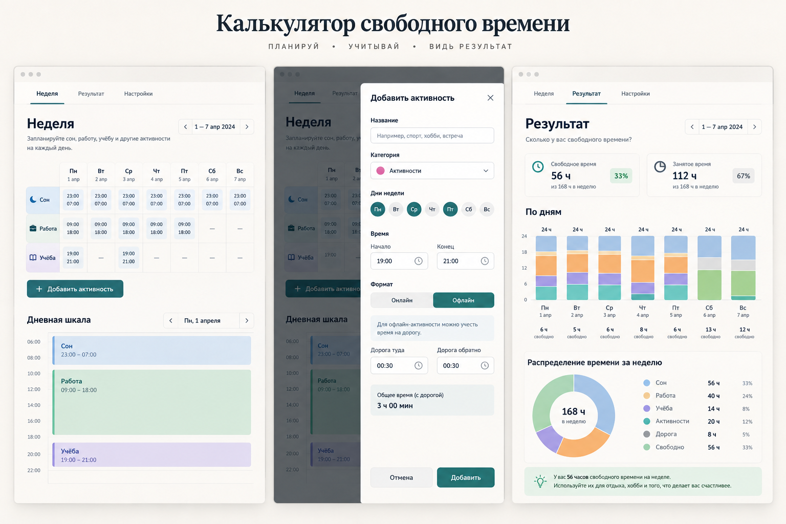
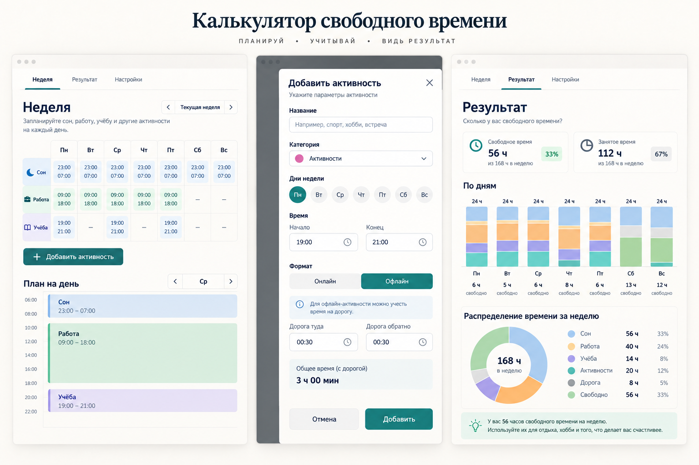
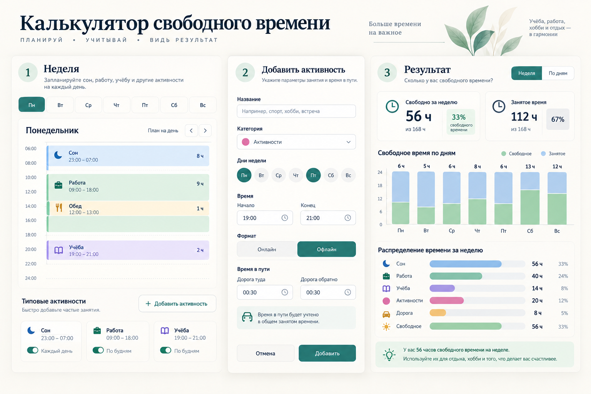
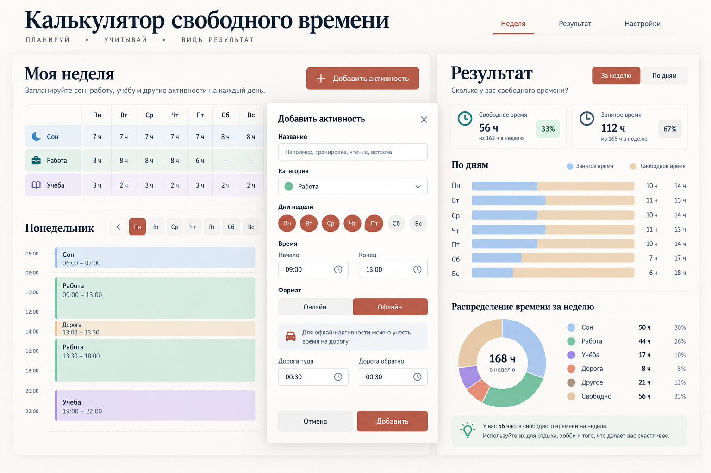
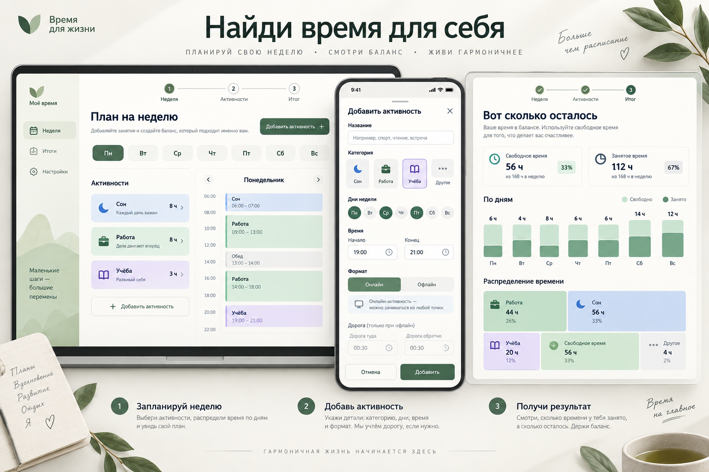
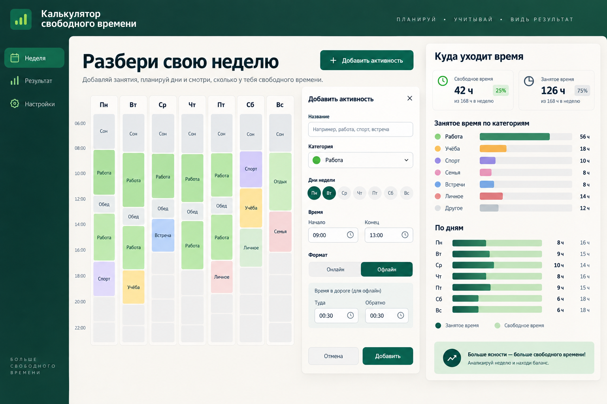
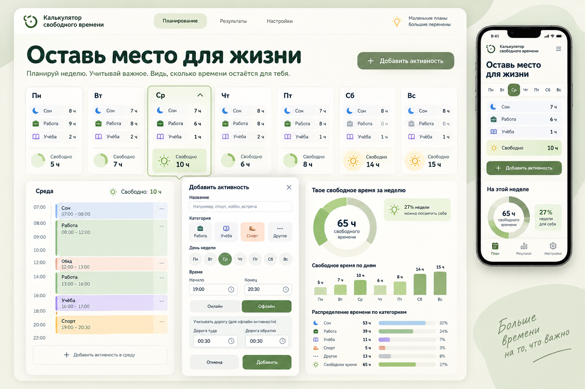
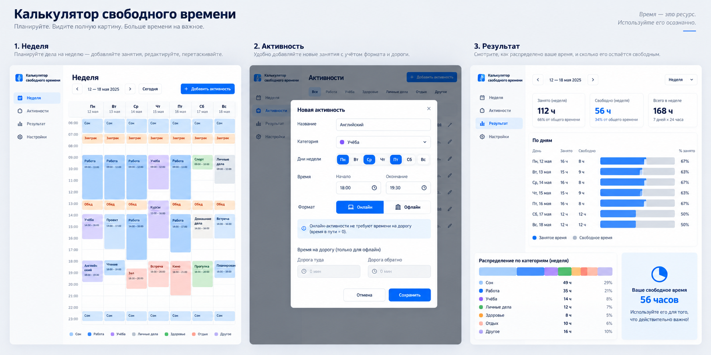
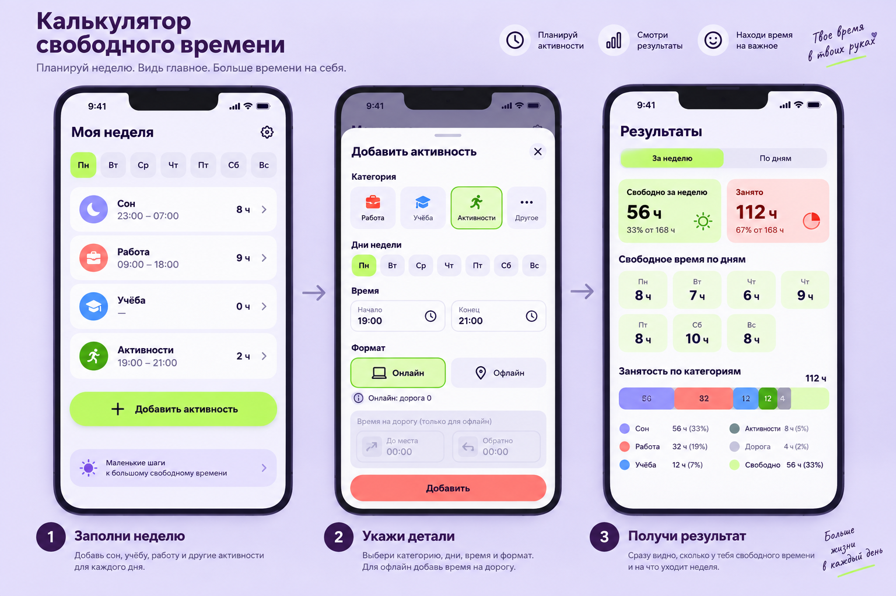

# Визуальные концепции

Эти изображения нужны для выбора направления дизайна. Они показывают путь от заполнения недели и добавления активности до результата. Числа, даты и подписи внутри сгенерированных mockup’ов иллюстративны и могут содержать ошибки: они не задают логику расчёта, набор категорий или точные тексты интерфейса. Продукт работает с **типичной повторяющейся неделей**, без привязки к календарным датам. Для online-активности дорога всегда равна нулю.

## A — спокойный редакционный интерфейс

Светлый фон, крупная типографика, таблица недели и дневная шкала. Добавление активности показано в боковой панели; результат — карточками, дневными столбцами и круговой диаграммой. Подойдёт, если важнее спокойное последовательное заполнение.

### Вариации A

После первого просмотра подготовлены три близких варианта того же спокойного направления. Это альтернативы исходной A, а не дополнительные обязательные экраны.

**A1 — уточнённая сетка.** Более заметная матрица повторяющейся недели, крупная форма и привычная сводка с круговой диаграммой.

**A2 — день в фокусе.** Поочерёдное заполнение дней, форма рядом с планом и горизонтальные полосы категорий вместо круговой диаграммы; мягкий шалфейный акцент.

**A3 — результат рядом с планом.** Широкая рабочая область и постоянно видимая сводка справа; тёплый терракотовый акцент.

## Три разных зелёных направления

Они сохраняют приятную зелёную гамму исходной A, но предлагают разные способы заполнения недели и чтения результата.

### G1 — последовательный сценарий

«Найди время для себя». Мягкий шалфейный цвет, лёгкая навигация по шагам, фокус на одном дне и крупная структурная диаграмма результата. Подходит, если важнее вести нового пользователя по процессу.

### G2 — рабочая панель недели

«Разбери свою неделю». Тёмно-зелёная навигация, плотная недельная сетка и постоянно видимая сводка. Подходит, если важнее сравнивать дни и быстро править расписание.

### G3 — карточки дней

«Оставь место для жизни». Светлый фисташковый тон, отдельные карточки дней, раскрываемый план выбранного дня и мобильная компоновка. Подходит, если важнее ощущение простоты и быстрый обзор свободного времени.

## B — компактный календарный интерфейс

Плотная сетка недели с цветными блоками. Форма активности открывается поверх расписания; результат показывает сравнение дней и распределение категорий. Подойдёт, если важнее видеть всю неделю сразу. Календарные даты на изображении при реализации заменяются днями типичной недели.

## C — карточный мобильный интерфейс

Крупные элементы и карточки для отдельного дня, нижняя панель добавления активности, короткая сводка результата. Подойдёт, если основной сценарий — заполнение с телефона. Макет также потребует настольной версии.

## Что показано во всех вариантах

- Заполнение дней недели и добавление активности.
- Выбор online/offline и поля дороги; для online дорога равна нулю.
- Свободное и занятое время, сравнение дней и распределение по категориям.

После выбора одного варианта нужно зафиксировать карту экранов, компоненты, цвета, типографику, состояния и правила для телефона и компьютера в `docs/design-system.md`. До выбора интерфейс не реализуется.
